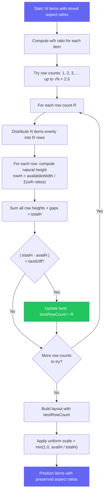

<p align="center">
  
  
  
  
</p>

<h1 align="center">Meeting Grid Layout</h1>

<p align="center">
  A modern, responsive grid library for video meeting layouts with smooth Motion animations.
  <br />
  Works with Vanilla JS, React, and Vue.
</p>

<p align="center">
  <a href="#demos">Demos</a> ·
  <a href="#features">Features</a> ·
  <a href="#packages">Packages</a> ·
  <a href="#installation">Installation</a> ·
  <a href="#quick-start">Quick Start</a> ·
  <a href="#layout-modes">Layout Modes</a> ·
  <a href="#api-reference">API Reference</a> ·
  <a href="#license">License</a>
</p>

<p align="center">
  <a href="./README.vi.md">Tiếng Việt</a>
</p>

---

## Demos

- [React Demo](https://meeting-react-grid.modern-ui.org/)
- [Vue Demo](https://meeting-vue-grid.modern-ui.org/)

---

## Features

| Feature                     | Description                                            |
| --------------------------- | ------------------------------------------------------ |
| **2 Layout Modes**          | Gallery (with optional Pin mode), Spotlight            |
| **Pin/Focus Support**       | Pin any participant to become the main view            |
| **Spring Animations**       | Smooth Motion (Framer Motion / Motion One) transitions |
| **Pagination**              | Split participants across pages with navigation        |
| **Max Visible + "+N More"** | Limit visible items and show overflow indicator        |
| **Flexible Aspect Ratios**  | Per-item ratios (phone 9:16, desktop 16:9)             |
| **Floating PiP**            | Draggable Picture-in-Picture with corner snapping      |
| **Grid Overlay**            | Full-grid overlay for screen sharing, whiteboard, etc. |
| **Responsive**              | Adapts to container size with justified packing        |
| **Framework Support**       | Vanilla JS, React 18+, Vue 3                           |
| **TypeScript**              | Full type definitions                                  |
| **Tree-shakeable**          | Import only what you need                              |

---

## Packages

| Package                                                                                                        | Description                    | Size |
| -------------------------------------------------------------------------------------------------------------- | ------------------------------ | ---- |
| [`@thangdevalone/meeting-grid-layout-core`](https://www.npmjs.com/package/@thangdevalone/meeting-grid-layout-core)   | Grid math only (Vanilla JS/TS) | ~3KB |
| [`@thangdevalone/meeting-grid-layout-react`](https://www.npmjs.com/package/@thangdevalone/meeting-grid-layout-react) | React components + Motion      | ~8KB |
| [`@thangdevalone/meeting-grid-layout-vue`](https://www.npmjs.com/package/@thangdevalone/meeting-grid-layout-vue)     | Vue 3 components + Motion      | ~8KB |

> React and Vue packages re-export everything from core — no need to install core separately.

---

## Installation

```bash
# Core only (Vanilla JavaScript/TypeScript)
npm install @thangdevalone/meeting-grid-layout-core

# React 18+
npm install @thangdevalone/meeting-grid-layout-react

# Vue 3
npm install @thangdevalone/meeting-grid-layout-vue
```

---

## Quick Start

### React

```tsx
import { GridContainer, GridItem } from '@thangdevalone/meeting-grid-layout-react'

function MeetingGrid({ participants }) {
  return (
    <GridContainer aspectRatio="16:9" gap={8} layoutMode="gallery" count={participants.length}>
      {participants.map((p, index) => (
        <GridItem key={p.id} index={index}>
          <VideoTile participant={p} />
        </GridItem>
      ))}
    </GridContainer>
  )
}
```

### Vue 3

```vue
<script setup>
import { GridContainer, GridItem } from '@thangdevalone/meeting-grid-layout-vue'

const participants = ref([...])
</script>

<template>
  <GridContainer aspect-ratio="16:9" :gap="8" :count="participants.length" layout-mode="gallery">
    <GridItem v-for="(p, index) in participants" :key="p.id" :index="index">
      <VideoTile :participant="p" />
    </GridItem>
  </GridContainer>
</template>
```

### Vanilla JavaScript

```javascript
import { createMeetGrid } from '@thangdevalone/meeting-grid-layout-core'

const grid = createMeetGrid({
  dimensions: { width: 800, height: 600 },
  count: 6,
  aspectRatio: '16:9',
  gap: 8,
  layoutMode: 'gallery',
})

for (let i = 0; i < 6; i++) {
  const { top, left } = grid.getPosition(i)
  const { width, height } = grid.getItemDimensions(i)

  element.style.cssText = `
    position: absolute;
    top: ${top}px;
    left: ${left}px;
    width: ${width}px;
    height: ${height}px;
  `
}
```

---

## Layout Modes

| Mode        | Description                                                 |
| ----------- | ----------------------------------------------------------- |
| `gallery`   | Flexible grid filling all space. Use `pinnedIndex` for pin. |
| `spotlight` | Single participant fills the entire container.              |

### Gallery with Pin

When `pinnedIndex` is set, the layout splits into a **Focus Area** (pinned item) and an **Others Area** (thumbnails):

```tsx
<GridContainer
  layoutMode="gallery"
  pinnedIndex={0}              // Pinned participant
  othersPosition="right"       // Others on the right
  count={participants.length}
>
```

| `othersPosition` | Description                                |
| ---------------- | ------------------------------------------ |
| `right`          | Thumbnails on the right (default)          |
| `left`           | Thumbnails on the left                     |
| `top`            | Thumbnails on top (horizontal strip)       |
| `bottom`         | Thumbnails on bottom (speaker-like layout) |

---

## Pagination

Split participants across multiple pages:

```tsx
<GridContainer
  count={participants.length}
  maxItemsPerPage={9}
  currentPage={currentPage}
>
```

For pin mode, use `maxVisible` and `currentVisiblePage` to paginate the "others" area:

```tsx
<GridContainer
  layoutMode="gallery"
  pinnedIndex={0}
  maxVisible={4}
  currentVisiblePage={othersPage}
>
```

---

## Max Visible with "+N More"

Limit visible items and show an overflow indicator:

```tsx
<GridContainer maxVisible={4} count={12}>
  {participants.map((p, index) => (
    <GridItem key={p.id} index={index}>
      {({ isLastVisibleOther, hiddenCount }) => (
        <>
          {isLastVisibleOther && hiddenCount > 0 ? (
            <div className="more-indicator">+{hiddenCount} more</div>
          ) : (
            <VideoTile participant={p} />
          )}
        </>
      )}
    </GridItem>
  ))}
</GridContainer>
```

---

## Flexible Aspect Ratios

Support different aspect ratios per participant (e.g., mobile portrait vs desktop landscape):

```tsx
const itemAspectRatios = [
  "16:9",    // Desktop landscape
  "9:16",    // Mobile portrait
  undefined, // Use global aspectRatio
]

<GridContainer
  aspectRatio="16:9"
  itemAspectRatios={itemAspectRatios}
>
```

| Value       | Description                                           |
| ----------- | ----------------------------------------------------- |
| `"16:9"`    | Fixed landscape ratio                                 |
| `"9:16"`    | Portrait video (mobile)                               |
| `"4:3"`     | Classic tablet ratio                                  |
| `"auto"`    | Stretch to fill the cell (default when not specified) |
| `undefined` | Use global `aspectRatio`                              |

### How the Flexible Gallery Algorithm Works

When participants have **mixed aspect ratios** (e.g., some on phones with 9:16, others on desktops with 16:9), the grid uses an **Optimal Row Search** algorithm to find the layout that minimizes wasted space while preserving correct aspect ratios.

#### Algorithm Flowchart



#### Step-by-Step

1. **Compute ratios** — For each item, calculate its width/height ratio from the aspect ratio string (e.g., `16:9` → `1.778`, `9:16` → `0.5625`).

2. **Try all row counts** — Instead of greedy packing (which can produce imbalanced layouts like `[4, 5, 1]`), the algorithm tries every possible row count from 1 up to `⌈√N × 2.5⌉`.

3. **Even distribution** — For each candidate row count `R`, items are distributed evenly: each row gets `⌊N/R⌋` or `⌈N/R⌉` items, preserving participant order.

4. **Natural height** — Each row's natural height is computed assuming it fills the full container width:

   ```
   rowHeight = (availableWidth - gaps) / Σ(w/h ratios of items in row)
   ```

5. **Best fit selection** — The algorithm picks the row count where `|totalHeight - availableHeight|` is smallest. This ensures the uniform scale factor is as close to `1.0` as possible.

6. **Uniform scaling** — A single scale factor is applied to both width and height of all items, preserving their aspect ratios. Items are centered in remaining space.

7. **Early exit** — Since `totalH` generally increases with more rows, the search exits early once it crosses `availH` (the optimal is already found).

#### Before vs After

<p align="center">
  
</p>

#### Visual Example: 9 Items with Mixed Ratios

```
Container: 1200 × 700px, items with ratios: 16:9, 9:16, 4:3, 1:1, 16:9, 9:16, 4:3, 1:1, 16:9

Row count search:
┌─────────────────────────────────────────────────────────────┐
│ Rows=1: [9 items]      totalH = 152px  │ diff = 548 ❌     │
│ Rows=2: [5, 4]         totalH = 680px  │ diff =  20 ✅ Best│
│ Rows=3: [3, 3, 3]      totalH = 1050px │ diff = 350 ❌     │
│ Rows=4: [3, 2, 2, 2]   totalH = 1520px │ diff = 820 ❌     │
└─────────────────────────────────────────────────────────────┘

Winner: 2 rows [5, 4] → globalScale = min(1.0, 700/680) = 1.0
→ Items fill 97% of container, aspect ratios perfectly preserved
```

#### Performance

| Metric          | Value                                               |
| --------------- | --------------------------------------------------- |
| Time complexity | `O(N × √N)` — N items × √N row candidates           |
| Space           | `O(N)` — only the winning distribution is allocated |
| Search phase    | Zero allocations — pure arithmetic on ratio array   |
| Typical speed   | < 0.1ms for 50 participants                         |
| Early exit      | Stops as soon as `totalH` crosses `availH`          |

---

## Floating PiP (Picture-in-Picture)

Draggable floating item that snaps to corners:

```tsx
import { FloatingGridItem } from '@thangdevalone/meeting-grid-layout-react'

;<GridContainer>
  {/* Main grid items */}

  <FloatingGridItem
    width={130}
    height={175}
    anchor="bottom-right"
    visible={true}
    edgePadding={12}
    borderRadius={8}
    onAnchorChange={(anchor) => console.log(anchor)}
  >
    <VideoTile participant={floatingParticipant} />
  </FloatingGridItem>
</GridContainer>
```

---

## Responsive PiP

PiP supports **responsive breakpoints** that auto-adjust size based on container width. You can use the built-in defaults or define your own custom breakpoints.

### Using Default Breakpoints

```tsx
import { FloatingGridItem, DEFAULT_FLOAT_BREAKPOINTS } from '@thangdevalone/meet-layout-grid-react'

// Standalone FloatingGridItem — auto-responsive with 5 levels
<FloatingGridItem breakpoints={DEFAULT_FLOAT_BREAKPOINTS}>
  <VideoTile />
</FloatingGridItem>

// Auto-float in 2-person mode — responsive PiP via GridContainer
<GridContainer count={2} floatBreakpoints={DEFAULT_FLOAT_BREAKPOINTS}>
  {participants.map((p, i) => (
    <GridItem key={p.id} index={i}><VideoTile participant={p} /></GridItem>
  ))}
</GridContainer>
```

**Default breakpoints (`DEFAULT_FLOAT_BREAKPOINTS`):**

| Level         | Container Width | PiP Size  |
| ------------- | --------------- | --------- |
| Small mobile  | 0 – 479px       | 100 × 135 |
| Mobile/Tablet | 480 – 767px     | 130 × 175 |
| Tablet        | 768 – 1023px    | 160 × 215 |
| Desktop       | 1024 – 1439px   | 180 × 240 |
| Large Desktop | 1440px+         | 220 × 295 |

### Custom Breakpoints

Define your own breakpoints with `PipBreakpoint[]`:

```tsx
import { FloatingGridItem } from '@thangdevalone/meet-layout-grid-react'
import type { PipBreakpoint } from '@thangdevalone/meet-layout-grid-react'

const myBreakpoints: PipBreakpoint[] = [
  { minWidth: 0, width: 80, height: 110 },       // Small screens
  { minWidth: 600, width: 150, height: 200 },     // Medium screens
  { minWidth: 1200, width: 250, height: 330 },    // Large screens
]

// Standalone FloatingGridItem
<FloatingGridItem breakpoints={myBreakpoints}>
  <VideoTile />
</FloatingGridItem>

// Auto-float in 2-person mode
<GridContainer count={2} floatBreakpoints={myBreakpoints}>
  ...
</GridContainer>
```

### Utility: `resolveFloatSize`

Programmatically resolve the PiP size for a given container width:

```ts
import { resolveFloatSize, DEFAULT_FLOAT_BREAKPOINTS } from '@thangdevalone/meet-layout-grid-react'

const size = resolveFloatSize(800, DEFAULT_FLOAT_BREAKPOINTS)
// → { width: 160, height: 215 }  (tablet breakpoint)
```

> **Note:** Fixed `width`/`height` props always override breakpoints when both are provided.
> The `breakpoints` system matches the largest `minWidth` that is ≤ the current container width.

---

## Grid Overlay

Full-grid overlay for screen sharing, whiteboard, or other content:

```tsx
import { GridOverlay } from '@thangdevalone/meeting-grid-layout-react'

;<GridContainer>
  {/* Grid items */}

  <GridOverlay visible={isScreenSharing} backgroundColor="rgba(0,0,0,0.8)">
    <ScreenShareView />
  </GridOverlay>
</GridContainer>
```

---

## Animation Presets

| Preset   | Use Case                 |
| -------- | ------------------------ |
| `snappy` | Fast UI feedback         |
| `smooth` | Layout changes (default) |
| `gentle` | Subtle motion            |
| `bouncy` | Slight overshoot         |

```tsx
<GridContainer springPreset="smooth">
```

---

## API Reference

### `createMeetGrid(options): MeetGridResult`

| Option               | Type                                     | Default     | Description                                                                       |
| -------------------- | ---------------------------------------- | ----------- | --------------------------------------------------------------------------------- |
| `dimensions`         | `{ width, height }`                      | required    | Container size in pixels                                                          |
| `count`              | `number`                                 | required    | Number of items                                                                   |
| `aspectRatio`        | `string`                                 | `'16:9'`    | Default tile aspect ratio                                                         |
| `gap`                | `number`                                 | `8`         | Gap between tiles (px)                                                            |
| `layoutMode`         | `'gallery' \| 'spotlight'`               | `'gallery'` | Layout mode                                                                       |
| `pinnedIndex`        | `number`                                 | -           | Index of pinned/focused participant                                               |
| `othersPosition`     | `'left' \| 'right' \| 'top' \| 'bottom'` | `'right'`   | Thumbnail position in pin mode                                                    |
| `maxItemsPerPage`    | `number`                                 | `0`         | Max items per page (gallery mode)                                                 |
| `currentPage`        | `number`                                 | `0`         | Current page (0-based)                                                            |
| `maxVisible`         | `number`                                 | `0`         | Max visible items (pin mode "others")                                             |
| `currentVisiblePage` | `number`                                 | `0`         | Current page for visible items                                                    |
| `itemAspectRatios`   | `(ItemAspectRatio \| undefined)[]`       | -           | Per-item aspect ratios                                                            |
| `floatWidth`         | `number`                                 | `120`       | Width of the auto-float PiP (2-person mode). Overrides breakpoints.               |
| `floatHeight`        | `number`                                 | `160`       | Height of the auto-float PiP (2-person mode). Overrides breakpoints.              |
| `floatBreakpoints`   | `PipBreakpoint[]`                        | -           | Responsive breakpoints for auto-float PiP (see [Responsive PiP](#responsive-pip)) |

### `MeetGridResult`

| Method / Property                         | Returns             | Description                             |
| ----------------------------------------- | ------------------- | --------------------------------------- |
| `getPosition(index)`                      | `{ top, left }`     | Position of item                        |
| `getItemDimensions(index)`                | `{ width, height }` | Cell dimensions                         |
| `getItemContentDimensions(index, ratio?)` | `ContentDimensions` | Content dimensions with offset          |
| `isItemVisible(index)`                    | `boolean`           | Whether item is visible on current page |
| `isMainItem(index)`                       | `boolean`           | Whether item is the main/pinned item    |
| `getLastVisibleOthersIndex()`             | `number`            | Index of last visible item in "others"  |
| `hiddenCount`                             | `number`            | Number of hidden items (for "+N more")  |
| `pagination`                              | `PaginationInfo`    | Pagination details                      |

### `PaginationInfo`

| Property      | Type      | Description                       |
| ------------- | --------- | --------------------------------- |
| `enabled`     | `boolean` | Whether pagination is active      |
| `currentPage` | `number`  | Current page index                |
| `totalPages`  | `number`  | Total number of pages             |
| `itemsOnPage` | `number`  | Items on current page             |
| `startIndex`  | `number`  | Start index of items on this page |
| `endIndex`    | `number`  | End index of items on this page   |

### `ContentDimensions`

| Property     | Type     | Description                     |
| ------------ | -------- | ------------------------------- |
| `width`      | `number` | Content width                   |
| `height`     | `number` | Content height                  |
| `offsetTop`  | `number` | Vertical offset for centering   |
| `offsetLeft` | `number` | Horizontal offset for centering |

### `FloatingGridItem` Props

Standalone draggable PiP component for custom floating items (independent of the auto-float in 2-person mode).

| Prop              | Type                                                           | Default                              | Description                                                    |
| ----------------- | -------------------------------------------------------------- | ------------------------------------ | -------------------------------------------------------------- |
| `children`        | `ReactNode`                                                    | required                             | Content to render inside the floating item                     |
| `width`           | `number`                                                       | `120`                                | Width of the floating item (px). Overridden by `breakpoints`.  |
| `height`          | `number`                                                       | `160`                                | Height of the floating item (px). Overridden by `breakpoints`. |
| `breakpoints`     | `PipBreakpoint[]`                                              | -                                    | Responsive breakpoints (see [Responsive PiP](#responsive-pip)) |
| `initialPosition` | `{ x: number; y: number }`                                     | `{ x: 16, y: 16 }`                   | Extra offset from anchor corner                                |
| `anchor`          | `'top-left' \| 'top-right' \| 'bottom-left' \| 'bottom-right'` | `'bottom-right'`                     | Which corner to snap/anchor the item                           |
| `visible`         | `boolean`                                                      | `true`                               | Whether the floating item is visible                           |
| `edgePadding`     | `number`                                                       | `12`                                 | Minimum padding from container edges (px)                      |
| `onAnchorChange`  | `(anchor) => void`                                             | -                                    | Callback when anchor corner changes after drag                 |
| `transition`      | `Transition`                                                   | `spring (stiffness 400, damping 30)` | Custom Motion transition for snap animation                    |
| `borderRadius`    | `number`                                                       | `12`                                 | Border radius of the floating item (px)                        |
| `boxShadow`       | `string`                                                       | `'0 4px 20px rgba(0,0,0,0.3)'`       | CSS box-shadow of the floating item                            |
| `className`       | `string`                                                       | -                                    | Additional CSS class name                                      |
| `style`           | `CSSProperties`                                                | -                                    | Custom style (merged with floating styles)                     |

#### Resize PiP

**Fixed size** — pass `width` and `height` directly:

```tsx
<FloatingGridItem width={200} height={270}>
  <VideoTile />
</FloatingGridItem>
```

**Responsive size** — use `breakpoints` to auto-adjust (see [Responsive PiP](#responsive-pip)):

```tsx
import { DEFAULT_FLOAT_BREAKPOINTS } from '@thangdevalone/meet-layout-grid-react'

;<FloatingGridItem breakpoints={DEFAULT_FLOAT_BREAKPOINTS}>
  <VideoTile />
</FloatingGridItem>
```

For the **auto-float PiP** in 2-person mode, use `floatBreakpoints` on `GridContainer`:

```tsx
<GridContainer count={2} floatBreakpoints={DEFAULT_FLOAT_BREAKPOINTS}>
  {participants.map((p, i) => (
    <GridItem key={p.id} index={i}>
      <VideoTile participant={p} />
    </GridItem>
  ))}
</GridContainer>
```

### `GridOverlay` Props

| Prop              | Type        | Default             | Description                 |
| ----------------- | ----------- | ------------------- | --------------------------- |
| `visible`         | `boolean`   | `true`              | Whether to show the overlay |
| `backgroundColor` | `string`    | `'rgba(0,0,0,0.5)'` | Overlay background color    |
| `children`        | `ReactNode` | -                   | Content inside the overlay  |

---

## Development

```bash
git clone https://github.com/thangdevalone/meeting-grid-layout.git
cd meeting-grid-layout

pnpm install
pnpm build

# Run demos
pnpm dev
# React: http://localhost:5173
# Vue: http://localhost:5174
```

Project structure:

```
meeting-grid-layout/
├── packages/
│   ├── core/       # Grid logic (framework-agnostic)
│   ├── react/      # React components + hooks
│   └── vue/        # Vue 3 components + composables
├── examples/
│   ├── react-demo/
│   └── vue-demo/
└── package.json
```

---

## License

MIT © [@thangdevalone](https://github.com/thangdevalone)

See [LICENSE](./LICENSE) for details.
