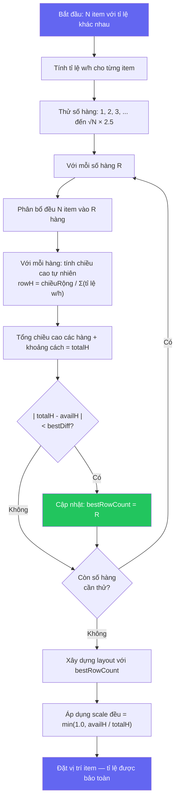

<p align="center">
  
  
  
  
</p>

<h1 align="center">Meet Layout Grid</h1>

<p align="center">
  Thư viện grid responsive cho bố cục video meeting với animation mượt mà.
  <br />
  Hỗ trợ Vanilla JS, React và Vue.
</p>

<p align="center">
  <a href="#demos">Demos</a> ·
  <a href="#tính-năng">Tính năng</a> ·
  <a href="#các-gói">Các gói</a> ·
  <a href="#cài-đặt">Cài đặt</a> ·
  <a href="#bắt-đầu-nhanh">Bắt đầu nhanh</a> ·
  <a href="#chế-độ-layout">Chế độ layout</a> ·
  <a href="#api-reference">API Reference</a> ·
  <a href="#giấy-phép">Giấy phép</a>
</p>

<p align="center">
  <a href="./README.md">English</a>
</p>

---

## Demos

- [React Demo](https://meeting-react-grid.modern-ui.org/)
- [Vue Demo](https://meeting-vue-grid.modern-ui.org/)

---

## Tính năng

| Tính năng                  | Mô tả                                                  |
| -------------------------- | ------------------------------------------------------ |
| **2 chế độ layout**        | Gallery (có hỗ trợ ghim), Spotlight                    |
| **Ghim participant**       | Ghim bất kỳ participant nào làm view chính             |
| **Animation spring**       | Motion (Framer Motion / Motion One) khi chuyển layout  |
| **Phân trang**             | Chia participant qua nhiều trang                       |
| **Giới hạn hiển thị "+N"** | Giới hạn số item và hiển thị chỉ báo overflow          |
| **Tỉ lệ linh hoạt**        | Tỉ lệ riêng cho từng item (phone 9:16, desktop 16:9)   |
| **Floating PiP**           | Picture-in-Picture kéo thả, snap vào góc               |
| **Grid Overlay**           | Overlay toàn grid cho screen sharing, whiteboard, v.v. |
| **Responsive**             | Tự động co giãn theo container với justified packing   |
| **Đa framework**           | Vanilla JS, React 18+, Vue 3                           |
| **TypeScript**             | Type đầy đủ                                            |
| **Tree-shakeable**         | Chỉ import phần cần dùng                               |

---

## Các gói

| Gói                                                                                                            | Mô tả                              | Dung lượng |
| -------------------------------------------------------------------------------------------------------------- | ---------------------------------- | ---------- |
| [`@thangdevalone/meet-layout-grid-core`](https://www.npmjs.com/package/@thangdevalone/meet-layout-grid-core)   | Chỉ tính toán grid (Vanilla JS/TS) | ~3KB       |
| [`@thangdevalone/meet-layout-grid-react`](https://www.npmjs.com/package/@thangdevalone/meet-layout-grid-react) | Component React + Motion           | ~8KB       |
| [`@thangdevalone/meet-layout-grid-vue`](https://www.npmjs.com/package/@thangdevalone/meet-layout-grid-vue)     | Component Vue 3 + Motion           | ~8KB       |

> Gói React và Vue đã re-export mọi thứ từ core — không cần cài core riêng.

---

## Cài đặt

```bash
# Chỉ core (Vanilla JavaScript/TypeScript)
npm install @thangdevalone/meet-layout-grid-core

# React 18+
npm install @thangdevalone/meet-layout-grid-react

# Vue 3
npm install @thangdevalone/meet-layout-grid-vue
```

---

## Bắt đầu nhanh

### React

```tsx
import { GridContainer, GridItem } from '@thangdevalone/meet-layout-grid-react'

function MeetingGrid({ participants }) {
  return (
    <GridContainer aspectRatio="16:9" gap={8} layoutMode="gallery" count={participants.length}>
      {participants.map((p, index) => (
        <GridItem key={p.id} index={index}>
          <VideoTile participant={p} />
        </GridItem>
      ))}
    </GridContainer>
  )
}
```

### Vue 3

```vue
<script setup>
import { GridContainer, GridItem } from '@thangdevalone/meet-layout-grid-vue'

const participants = ref([...])
</script>

<template>
  <GridContainer aspect-ratio="16:9" :gap="8" :count="participants.length" layout-mode="gallery">
    <GridItem v-for="(p, index) in participants" :key="p.id" :index="index">
      <VideoTile :participant="p" />
    </GridItem>
  </GridContainer>
</template>
```

### Vanilla JavaScript

```javascript
import { createMeetGrid } from '@thangdevalone/meet-layout-grid-core'

const grid = createMeetGrid({
  dimensions: { width: 800, height: 600 },
  count: 6,
  aspectRatio: '16:9',
  gap: 8,
  layoutMode: 'gallery',
})

for (let i = 0; i < 6; i++) {
  const { top, left } = grid.getPosition(i)
  const { width, height } = grid.getItemDimensions(i)

  element.style.cssText = `
    position: absolute;
    top: ${top}px;
    left: ${left}px;
    width: ${width}px;
    height: ${height}px;
  `
}
```

---

## Chế độ layout

| Chế độ      | Mô tả                                                         |
| ----------- | ------------------------------------------------------------- |
| `gallery`   | Grid linh hoạt lấp đầy không gian. Dùng `pinnedIndex` để ghim |
| `spotlight` | Một participant chiếm toàn bộ container                       |

### Gallery với ghim

Khi đặt `pinnedIndex`, layout chia thành **Vùng chính** (item được ghim) và **Vùng phụ** (thumbnail):

```tsx
<GridContainer
  layoutMode="gallery"
  pinnedIndex={0}              // Participant được ghim
  othersPosition="right"       // Thumbnail bên phải
  count={participants.length}
>
```

| `othersPosition` | Mô tả                              |
| ---------------- | ---------------------------------- |
| `right`          | Thumbnail bên phải (mặc định)      |
| `left`           | Thumbnail bên trái                 |
| `top`            | Thumbnail phía trên (dải ngang)    |
| `bottom`         | Thumbnail phía dưới (kiểu speaker) |

---

## Phân trang

Chia participant qua nhiều trang:

```tsx
<GridContainer
  count={participants.length}
  maxItemsPerPage={9}
  currentPage={currentPage}
>
```

Với chế độ ghim, dùng `maxVisible` và `currentVisiblePage` để phân trang vùng "others":

```tsx
<GridContainer
  layoutMode="gallery"
  pinnedIndex={0}
  maxVisible={4}
  currentVisiblePage={othersPage}
>
```

---

## Giới hạn hiển thị "+N thêm"

Giới hạn số item hiển thị và hiện chỉ báo overflow:

```tsx
<GridContainer maxVisible={4} count={12}>
  {participants.map((p, index) => (
    <GridItem key={p.id} index={index}>
      {({ isLastVisibleOther, hiddenCount }) => (
        <>
          {isLastVisibleOther && hiddenCount > 0 ? (
            <div className="more-indicator">+{hiddenCount} thêm</div>
          ) : (
            <VideoTile participant={p} />
          )}
        </>
      )}
    </GridItem>
  ))}
</GridContainer>
```

---

## Tỉ lệ linh hoạt

Hỗ trợ tỉ lệ khác nhau cho từng participant (ví dụ: mobile dọc vs desktop ngang):

```tsx
const itemAspectRatios = [
  "16:9",    // Desktop ngang
  "9:16",    // Mobile dọc
  undefined, // Dùng aspectRatio chung
]

<GridContainer
  aspectRatio="16:9"
  itemAspectRatios={itemAspectRatios}
>
```

| Giá trị     | Mô tả                                              |
| ----------- | -------------------------------------------------- |
| `"16:9"`    | Tỉ lệ ngang cố định                                |
| `"9:16"`    | Video dọc (điện thoại)                             |
| `"4:3"`     | Tỉ lệ tablet cổ điển                               |
| `"auto"`    | Co giãn lấp đầy cell (mặc định khi không chỉ định) |
| `undefined` | Sử dụng global `aspectRatio`                       |

### Thuật toán Gallery linh hoạt

Khi các participant có **tỉ lệ khác nhau** (ví dụ: điện thoại 9:16, máy tính 16:9), grid sử dụng thuật toán **Tìm kiếm số hàng tối ưu** để tìm bố cục ít lãng phí không gian nhất mà vẫn giữ đúng tỉ lệ.

#### Sơ đồ thuật toán



#### Các bước chi tiết

1. **Tính tỉ lệ** — Với mỗi item, tính tỉ lệ chiều rộng/chiều cao từ aspect ratio (ví dụ: `16:9` → `1.778`, `9:16` → `0.5625`).

2. **Thử tất cả số hàng** — Thay vì xếp tham lam (greedy packing — có thể tạo layout lệch như `[4, 5, 1]`), thuật toán thử mọi số hàng từ 1 đến `⌈√N × 2.5⌉`.

3. **Phân bổ đều** — Với mỗi số hàng `R`, item được chia đều: mỗi hàng `⌊N/R⌋` hoặc `⌈N/R⌉` item, giữ nguyên thứ tự participant.

4. **Chiều cao tự nhiên** — Chiều cao tự nhiên của mỗi hàng được tính khi nó fill hết chiều rộng container:

   ```
   rowHeight = (chiều rộng - khoảng cách) / Σ(tỉ lệ w/h của item trong hàng)
   ```

5. **Chọn phương án tốt nhất** — Thuật toán chọn số hàng mà `|totalHeight - availableHeight|` nhỏ nhất. Điều này giúp hệ số scale đều gần `1.0` nhất có thể.

6. **Scale đều** — Cùng một hệ số scale áp dụng cho cả chiều rộng và chiều cao, **bảo toàn đúng tỉ lệ**. Item được căn giữa trong không gian còn lại.

7. **Thoát sớm** — Vì `totalH` tăng theo số hàng, vòng lặp dừng ngay khi vượt qua `availH` (phương án tối ưu đã tìm được).

#### So sánh trước và sau

<p align="center">
  
</p>

#### Ví dụ trực quan: 9 item với tỉ lệ hỗn hợp

```
Container: 1200 × 700px, tỉ lệ: 16:9, 9:16, 4:3, 1:1, 16:9, 9:16, 4:3, 1:1, 16:9

Tìm kiếm số hàng:
┌─────────────────────────────────────────────────────────────────┐
│ Rows=1: [9 items]      totalH = 152px  │ diff = 548 ❌         │
│ Rows=2: [5, 4]         totalH = 680px  │ diff =  20 ✅ Tốt nhất│
│ Rows=3: [3, 3, 3]      totalH = 1050px │ diff = 350 ❌         │
│ Rows=4: [3, 2, 2, 2]   totalH = 1520px │ diff = 820 ❌         │
└─────────────────────────────────────────────────────────────────┘

Thắng: 2 hàng [5, 4] → globalScale = min(1.0, 700/680) = 1.0
→ Item lấp 97% container, tỉ lệ được bảo toàn hoàn hảo
```

#### Hiệu năng

| Chỉ số                | Giá trị                                                     |
| --------------------- | ----------------------------------------------------------- |
| Độ phức tạp thời gian | `O(N × √N)` — N item × √N ứng viên hàng                     |
| Bộ nhớ                | `O(N)` — chỉ phân bổ mảng cho phương án thắng               |
| Pha tìm kiếm          | Không cấp phát bộ nhớ — chỉ tính arithmetic trên mảng tỉ lệ |
| Tốc độ thực tế        | < 0.1ms cho 50 participant                                  |
| Thoát sớm             | Dừng ngay khi `totalH` vượt qua `availH`                    |

---

## Floating PiP (Picture-in-Picture)

Item nổi kéo thả, snap vào góc:

```tsx
import { FloatingGridItem } from '@thangdevalone/meet-layout-grid-react'
;<GridContainer>
  {/* Các grid item chính */}

  <FloatingGridItem
    width={130}
    height={175}
    anchor="bottom-right"
    visible={true}
    edgePadding={12}
    borderRadius={8}
    onAnchorChange={(anchor) => console.log(anchor)}
  >
    <VideoTile participant={floatingParticipant} />
  </FloatingGridItem>
</GridContainer>
```

---

## Responsive PiP

PiP hỗ trợ **responsive breakpoints** tự động điều chỉnh kích thước theo chiều rộng container. Bạn có thể dùng breakpoints mặc định hoặc tự định nghĩa.

### Dùng breakpoints mặc định

```tsx
import { FloatingGridItem, DEFAULT_FLOAT_BREAKPOINTS } from '@thangdevalone/meet-layout-grid-react'

// FloatingGridItem độc lập — responsive tự động 5 mức
<FloatingGridItem breakpoints={DEFAULT_FLOAT_BREAKPOINTS}>
  <VideoTile />
</FloatingGridItem>

// Auto-float chế độ 2 người — responsive PiP qua GridContainer
<GridContainer count={2} floatBreakpoints={DEFAULT_FLOAT_BREAKPOINTS}>
  {participants.map((p, i) => (
    <GridItem key={p.id} index={i}><VideoTile participant={p} /></GridItem>
  ))}
</GridContainer>
```

**Breakpoints mặc định (`DEFAULT_FLOAT_BREAKPOINTS`):**

| Mức           | Chiều rộng container | Kích thước PiP |
| ------------- | -------------------- | -------------- |
| Mobile nhỏ    | 0 – 479px            | 100 × 135      |
| Mobile/Tablet | 480 – 767px          | 130 × 175      |
| Tablet        | 768 – 1023px         | 160 × 215      |
| Desktop       | 1024 – 1439px        | 180 × 240      |
| Desktop lớn   | 1440px+              | 220 × 295      |

### Tự định nghĩa breakpoints

Tạo breakpoints riêng với `PipBreakpoint[]`:

```tsx
import { FloatingGridItem } from '@thangdevalone/meet-layout-grid-react'
import type { PipBreakpoint } from '@thangdevalone/meet-layout-grid-react'

const myBreakpoints: PipBreakpoint[] = [
  { minWidth: 0, width: 80, height: 110 },       // Màn hình nhỏ
  { minWidth: 600, width: 150, height: 200 },     // Màn hình vừa
  { minWidth: 1200, width: 250, height: 330 },    // Màn hình lớn
]

// FloatingGridItem độc lập
<FloatingGridItem breakpoints={myBreakpoints}>
  <VideoTile />
</FloatingGridItem>

// Auto-float chế độ 2 người
<GridContainer count={2} floatBreakpoints={myBreakpoints}>
  ...
</GridContainer>
```

### Utility: `resolveFloatSize`

Xác định kích thước PiP lập trình cho chiều rộng container cụ thể:

```ts
import { resolveFloatSize, DEFAULT_FLOAT_BREAKPOINTS } from '@thangdevalone/meet-layout-grid-react'

const size = resolveFloatSize(800, DEFAULT_FLOAT_BREAKPOINTS)
// → { width: 160, height: 215 }  (breakpoint tablet)
```

> **Lưu ý:** Props `width`/`height` cố định luôn ghi đè breakpoints khi cả hai được truyền.
> Hệ thống `breakpoints` chọn breakpoint có `minWidth` lớn nhất mà ≤ chiều rộng container hiện tại.

---

## Grid Overlay

Overlay toàn grid cho screen sharing, whiteboard, hoặc nội dung khác:

```tsx
import { GridOverlay } from '@thangdevalone/meet-layout-grid-react'
;<GridContainer>
  {/* Các grid item */}

  <GridOverlay visible={isScreenSharing} backgroundColor="rgba(0,0,0,0.8)">
    <ScreenShareView />
  </GridOverlay>
</GridContainer>
```

---

## Preset animation

| Preset   | Dùng khi              |
| -------- | --------------------- |
| `snappy` | Phản hồi nhanh        |
| `smooth` | Đổi layout (mặc định) |
| `gentle` | Chuyển động nhẹ       |
| `bouncy` | Hơi overshoot         |

```tsx
<GridContainer springPreset="smooth">
```

---

## API Reference

### `createMeetGrid(options): MeetGridResult`

| Option               | Kiểu                                     | Mặc định    | Mô tả                                                                          |
| -------------------- | ---------------------------------------- | ----------- | ------------------------------------------------------------------------------ |
| `dimensions`         | `{ width, height }`                      | bắt buộc    | Kích thước container (px)                                                      |
| `count`              | `number`                                 | bắt buộc    | Số item                                                                        |
| `aspectRatio`        | `string`                                 | `'16:9'`    | Tỉ lệ tile mặc định                                                            |
| `gap`                | `number`                                 | `8`         | Khoảng cách giữa tile (px)                                                     |
| `layoutMode`         | `'gallery' \| 'spotlight'`               | `'gallery'` | Chế độ layout                                                                  |
| `pinnedIndex`        | `number`                                 | -           | Index của participant được ghim                                                |
| `othersPosition`     | `'left' \| 'right' \| 'top' \| 'bottom'` | `'right'`   | Vị trí thumbnail khi ghim                                                      |
| `maxItemsPerPage`    | `number`                                 | `0`         | Số item tối đa mỗi trang                                                       |
| `currentPage`        | `number`                                 | `0`         | Trang hiện tại (0-based)                                                       |
| `maxVisible`         | `number`                                 | `0`         | Số item hiển thị tối đa (vùng others)                                          |
| `currentVisiblePage` | `number`                                 | `0`         | Trang hiện tại cho visible items                                               |
| `itemAspectRatios`   | `(ItemAspectRatio \| undefined)[]`       | -           | Tỉ lệ riêng cho từng item                                                      |
| `floatWidth`         | `number`                                 | `120`       | Chiều rộng PiP tự động (chế độ 2 người). Ghi đè breakpoints.                   |
| `floatHeight`        | `number`                                 | `160`       | Chiều cao PiP tự động (chế độ 2 người). Ghi đè breakpoints.                    |
| `floatBreakpoints`   | `PipBreakpoint[]`                        | -           | Breakpoints responsive cho PiP tự động (xem [Responsive PiP](#responsive-pip)) |

### `MeetGridResult`

| Method / Property                         | Trả về              | Mô tả                                    |
| ----------------------------------------- | ------------------- | ---------------------------------------- |
| `getPosition(index)`                      | `{ top, left }`     | Vị trí của item                          |
| `getItemDimensions(index)`                | `{ width, height }` | Kích thước cell                          |
| `getItemContentDimensions(index, ratio?)` | `ContentDimensions` | Kích thước content thực tế với offset    |
| `isItemVisible(index)`                    | `boolean`           | Item có hiển thị trên trang hiện tại     |
| `isMainItem(index)`                       | `boolean`           | Item có phải là item chính (pinned)      |
| `getLastVisibleOthersIndex()`             | `number`            | Index item cuối cùng hiển thị ở "others" |
| `hiddenCount`                             | `number`            | Số item bị ẩn (cho "+N thêm")            |
| `pagination`                              | `PaginationInfo`    | Thông tin phân trang                     |

### `PaginationInfo`

| Property      | Kiểu      | Mô tả                       |
| ------------- | --------- | --------------------------- |
| `enabled`     | `boolean` | Phân trang có bật không     |
| `currentPage` | `number`  | Index trang hiện tại        |
| `totalPages`  | `number`  | Tổng số trang               |
| `itemsOnPage` | `number`  | Số item trên trang hiện tại |
| `startIndex`  | `number`  | Index bắt đầu của trang     |
| `endIndex`    | `number`  | Index kết thúc của trang    |

### `ContentDimensions`

| Property     | Kiểu     | Mô tả                    |
| ------------ | -------- | ------------------------ |
| `width`      | `number` | Chiều rộng content       |
| `height`     | `number` | Chiều cao content        |
| `offsetTop`  | `number` | Offset dọc để căn giữa   |
| `offsetLeft` | `number` | Offset ngang để căn giữa |

### Props của `FloatingGridItem`

Component PiP kéo thả độc lập (không phải PiP tự động trong chế độ 2 người).

| Prop              | Kiểu                                                           | Mặc định                             | Mô tả                                                          |
| ----------------- | -------------------------------------------------------------- | ------------------------------------ | -------------------------------------------------------------- |
| `children`        | `ReactNode` / `slot`                                           | bắt buộc                             | Nội dung bên trong PiP                                         |
| `width`           | `number`                                                       | `120`                                | Chiều rộng PiP (px). Bị ghi đè bởi `breakpoints`.              |
| `height`          | `number`                                                       | `160`                                | Chiều cao PiP (px). Bị ghi đè bởi `breakpoints`.               |
| `breakpoints`     | `PipBreakpoint[]`                                              | -                                    | Breakpoints responsive (xem [Responsive PiP](#responsive-pip)) |
| `initialPosition` | `{ x: number; y: number }`                                     | `{ x: 16, y: 16 }`                   | Offset thêm từ góc neo                                         |
| `anchor`          | `'top-left' \| 'top-right' \| 'bottom-left' \| 'bottom-right'` | `'bottom-right'`                     | Góc neo/snap cho PiP                                           |
| `visible`         | `boolean`                                                      | `true`                               | Hiển thị PiP hay không                                         |
| `edgePadding`     | `number`                                                       | `12`                                 | Khoảng cách tối thiểu từ viền container (px)                   |
| `onAnchorChange`  | `(anchor) => void` / `@anchor-change`                          | -                                    | Callback khi góc neo thay đổi sau khi kéo thả                  |
| `transition`      | `Transition`                                                   | `spring (stiffness 400, damping 30)` | Transition tùy chỉnh cho animation snap                        |
| `borderRadius`    | `number`                                                       | `12`                                 | Bo góc PiP (px)                                                |
| `boxShadow`       | `string`                                                       | `'0 4px 20px rgba(0,0,0,0.3)'`       | CSS box-shadow của PiP                                         |
| `className`       | `string`                                                       | -                                    | Class CSS bổ sung                                              |
| `style`           | `CSSProperties`                                                | -                                    | Style tùy chỉnh (merge với style mặc định)                     |

#### Chỉnh kích thước PiP

**Kích thước cố định** — truyền `width` và `height` trực tiếp:

```tsx
<FloatingGridItem width={200} height={270}>
  <VideoTile />
</FloatingGridItem>
```

**Kích thước responsive** — dùng `breakpoints` tự động điều chỉnh (xem [Responsive PiP](#responsive-pip)):

```tsx
import { DEFAULT_FLOAT_BREAKPOINTS } from '@thangdevalone/meet-layout-grid-react'
;<FloatingGridItem breakpoints={DEFAULT_FLOAT_BREAKPOINTS}>
  <VideoTile />
</FloatingGridItem>
```

Với **PiP tự động** chế độ 2 người, dùng `floatBreakpoints` trên `GridContainer`:

```tsx
<GridContainer count={2} floatBreakpoints={DEFAULT_FLOAT_BREAKPOINTS}>
  {participants.map((p, i) => (
    <GridItem key={p.id} index={i}>
      <VideoTile participant={p} />
    </GridItem>
  ))}
</GridContainer>
```

### Props của `GridOverlay`

| Prop              | Kiểu                 | Mặc định            | Mô tả                      |
| ----------------- | -------------------- | ------------------- | -------------------------- |
| `visible`         | `boolean`            | `true`              | Hiển thị overlay hay không |
| `backgroundColor` | `string`             | `'rgba(0,0,0,0.5)'` | Màu nền overlay            |
| `children`        | `ReactNode` / `slot` | -                   | Nội dung bên trong overlay |

---

## Phát triển

```bash
git clone https://github.com/thangdevalone/meet-layout-grid.git
cd meet-layout-grid

pnpm install
pnpm build

# Chạy demo
pnpm dev
# React: http://localhost:5173
# Vue: http://localhost:5174
```

Cấu trúc dự án:

```
meet-layout-grid/
├── packages/
│   ├── core/       # Logic grid (không phụ thuộc framework)
│   ├── react/      # React component + hooks
│   └── vue/        # Vue 3 component + composables
├── examples/
│   ├── react-demo/
│   └── vue-demo/
└── package.json
```

---

## Giấy phép

MIT © [@thangdevalone](https://github.com/thangdevalone)

Xem [LICENSE](./LICENSE) để biết chi tiết.
